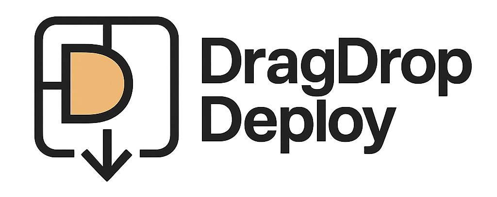
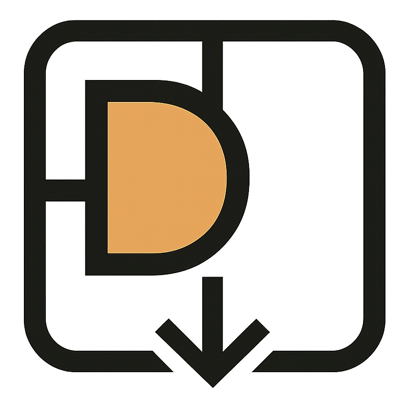

# DragDropDeploy

<!-- Project Logo -->
<p align="center">

</p>
<p align="center">
	<a href="https://github.com/TomKonig/DragDropDeploy/actions/workflows/ci.yml"></a>
	<a href="./LICENSE"></a>
	<a href="./CHANGELOG.md"></a>
	<a href="./docs/roadmap.md"></a>
	<a href="https://github.com/TomKonig/DragDropDeploy/issues"></a>
</p>

Self‑hosted, lightweight static (and future hybrid) site hosting — drop in your site and share the link. An open alternative to closed platforms like Tiiny.host, Cloudflare Pages, and Netlify, designed for people who want control, customization, and low resource usage.

> Drag & drop a ZIP → get a staging URL → go live. Keep ownership of your data and deploy on your own hardware (even a modest VPS or homelab box).

## Why DragDropDeploy?

**Own your platform.** No vendor lock‑in, MIT licensed. Run it privately for yourself or offer hosting to others.

**Built for self‑hosters.** Minimal services (Postgres + optional Redis + Traefik). Lean runtime so small servers run comfortably.

**Multi‑tenant ready.** Host multiple users, each with their own projects, custom domains or shared subdomains.

**Extensible by design.** Theme system, plugin hooks (early), localization files, and planned marketplace for themes, plugins, and language packs.

**Future‑proof.** Roadmap includes broad static site generator (SSG) coverage and optional non‑serverless runtime support.

**Admin friendly.** As many settings as possible live in the dashboard instead of piling on environment variables.

**Monetization ready.** Endpoints prepared for integrating Stripe and pricing tiers (plans, quotas, usage metrics) — bring your own billing.

## Core Features (Current / Emerging)

- Email/password login (first user auto‑elevated to operator)
- Create & manage projects
- Secure ZIP upload & artifact storage
- Build jobs (simulated or real execution behind a flag)
- Static asset minification (toggle per project; global override)
- Project-level build flags (allow‑listed, safely redacted in logs)
- Version tracking groundwork (build history & logs)
- Clean file serving with path safety checks
- OpenAPI docs at `/docs`
- Internationalization foundation (YAML locales)
- Metrics endpoint (Prometheus) & structured logs

See the user‑oriented roadmap for “Now / Next / Later”: [`docs/roadmap.md`](docs/roadmap.md)

## Coming Soon (Highlights)

- One‑click rollback & version retention
- Custom + wildcard domain routing
- OAuth sign‑in (GitHub / Google)
- Theming & marketplace publishing flow
- Plugin execution sandbox
- Health checks & page quality signals
- Tier‑based retention quotas

## Quickstart (5 Minutes)

> Full install, advanced tuning, and operations docs live in the documentation site. This is the short version.

```bash
git clone https://github.com/TomKonig/DragDropDeploy.git
cd DragDropDeploy
cp .env.example .env  # set DATABASE_URL + JWT_SECRET
docker compose up -d
```

Visit <http://localhost:3000> and register — the first account becomes the operator.

### Minimal Environment

| Variable | Purpose |
|----------|---------|
| DATABASE_URL | Postgres connection string |
| JWT_SECRET | 16+ char signing secret |
| MAX_UPLOAD_MB | (optional) ZIP upload size limit (default 25) |
| ARTIFACTS_DIR | (optional) Artifact storage path |

More: see `CONFIGURATION.md`.

## Extensibility & Customization

| Aspect | Status | Notes |
|--------|--------|-------|
| Themes | 🔜 | Token‑based styling & future theme marketplace |
| Plugins | 🟡 | Hook surfaces forming; sandbox & permissions planned |
| Locales | 🟡 | i18n foundation; community language packs welcome |
| Build Flags | ✅ | Allow‑listed per project, appended to build command |
| Minification | ✅ | HTML/CSS/JS with opt‑out and global force flag |

## Architecture at a Glance

Simple service layout: API (NestJS), optional Redis queue, Postgres DB, reverse proxy (Traefik). All chosen for low friction self hosting, clarity, and future scalability without forcing complexity early.

## Contributing

We welcome contributions: new integrations, themes, plugins, locales, docs improvements, and core features.

Branch workflow: open PRs against `develop` (integration branch). Production releases are cut from `main`. See detailed guidance in `docs/development/branching-strategy.md`.

1. Check open issues or propose an idea via a discussion.
2. Fork & create a feature branch.
3. Add/adjust tests for behavior changes.
4. Submit a PR referencing any related issue.

For deeper internals & release process see:

- `CONTRIBUTING.md` (guidelines)
- `MAINTAINERS.md` (architecture & subsystem notes)
- `CONFIGURATION.md` (all settings)
- `CHANGELOG.md` (history)

For how we structure docs (what belongs in the README vs deeper guides), see [Documentation Philosophy](./DOCUMENTATION_PHILOSOPHY.md).

## Philosophy

- Start simple; optimize only when real usage demands it.
- Prefer explicit, observable behavior over hidden automation.
- Keep resource usage low so hobby hardware works.
- Enable customization without mandatory plugins.

## Releasing (Maintainers)

Monorepo single version. Scripts (patch/minor/major) update packages & changelog. See `VERSIONING.md` for full workflow. Typical example:

```bash
npm run release:patch:tag
```

Creates commit + tag and stamps the date. Push with `:push` variant or manually push tags afterward.

## License

MIT — permissive for commercial & private use. See `LICENSE`.

---
Early stage software: expect iteration. Feedback welcome.

<br/>
<div align="center">

<p><sub>DragDropDeploy</sub></p>
</div>
